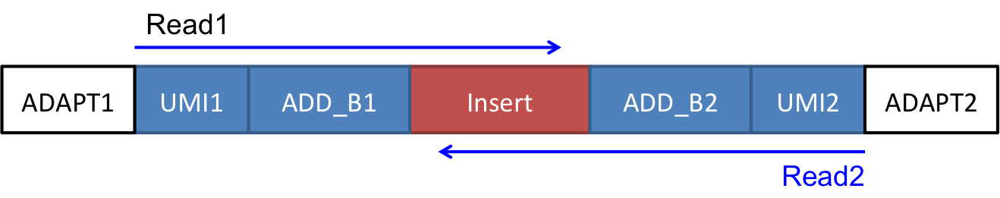

# proseq2.0
Preprocesses and Aligns Run-On Sequencing (PRO/GRO/ChRO-seq) data from Single-Read or Paired-End Illumina Sequencing

## Overview
Our pro-seq2.0 pipeline will take single-end or paired-end sequencing reads in fastq.gz format as input. The pipeline will automate three routine pre-processing and alignment options, including
+ pre-processing reads: remove the adapter sequence and quality trim the reads (cutadapt), deduplicate the reads if UMI barcodes are used (prinseq-lite.pl)
+ mapping reads to a reference genome (BWA)
+ converting BAM files into bedGraph and BigWig formats (kentsource). When converting to bedGraph and BigWig, the pipeline only report the 5’ end position of the reads after UMI/adapter removal. For pair-end sequencing, user can choose to report the 5’ end of R1 or R2 reads.

To run our pipeline users must first download the pipeline files and install dependencies indicated in this README.md. In addition, user need to provide a path to a BWA index file and the path to the chromInfo file for the genome of choice. After running this pipeline, users should have processed data files in the specified output directory.


## Dependencies: 


The pipelines depend on several common bioinformatics tools: 
- [ ] cutadapt
- [ ] prinseq-lite.pl
- [ ] bwa
- [ ] samtools
- [ ] bedtools
- [ ] bedGraphToBigWig (from the Kent source utilities)

Please make sure you can call the bioinformatics tools from your current working directory.    


## Usage
```
Preprocesses and aligns PRO-seq data.

Takes PREFIX.fastq.gz (SE),  PREFIX_R1.fastq.gz, PREFIX_R2.fastq.gz (PE)
or *.fastq.gz in the current working directory as input and writes
BAM and bigWig files as output to the user-assigned output-dir.

Requirements in current working directory:
cutadapt 1.8.3, prinseq-lite.pl 0.20.2, bwa, samtools, bedtools, and bedGraphToBigWig.

bash proseq2.0.bsh [options]

options:

To get help:
-h, --help             Show this brief help menu.

Required options:
-SE, --SEQ=SE          Single-end sequencing.
-PE, --SEQ=PE          Paired-end sequencing.
-i, --bwa-index=PATH   Path to the BWA index of the target genome
                       (i.e., bwa index).
-c, --chrom-info=PATH  Location of the chromInfo table.

I/O options:
-I, --fastq=PREFIX     Prefix for input files.
                       Paired-end files require identical prefix
                       and end with _R1.fastq.gz and _R2.fastq.gz
                       eg: PREFIX_R1.fastq.gz, PREFIX_R2.fastq.gz.
-T, --tmp=PATH         Path to a temporary storage directory.
-O, --output-dir=DIR   Specify a directory to store output in.

Required options for SE
-G, --SE_READ=RNA_5prime Single-end sequencing from 5' end of
                         nascent RNA, like GRO-seq.
-P, --SE_READ=RNA_3prime Single-end sequencing from 3' end of
                         nascent RNA, like PRO-seq.

Options for PE
--RNA5=R1_5prime    Specify the location of the 5' end of RNA
                    [default: R1_5prime].
--RNA3=R2_5prime    Specify the location of the 3' end of RNA
                    [default: R2_5prime].
                    Available options: R1_5prime: the 5' end of R1 reads
                                       R2_5prime: the 5' end of R2 reads
-5, --map5=TRUE     Report the 5' end of RNA [default on, --map5=TRUE].
-3, --map5=FALSE    Report the 3' end of RNA,
                    only available for PE [default off, --map5=TRUE].
-s, --opposite-strand=TRUE
                    Enable this option if the RNA are at the different strand
                    as the reads set at RNA5 [default: disable].

Optional operations:
--ADAPT_SE=TGGAATTCTCGGGTGCCAAGG
                    3' adapter to be removed from the 3' end of SE reads.
--ADAPT1=GATCGTCGGACTGTAGAACTCTGAACG
                    3' adapter to be removed from the 3' end of R2.
--ADAPT2=AGATCGGAAGAGCACACGTCTGAACTC
                    3' adapter to be removed from the 3' end of R1.

--UMI1=0            The length of UMI barcode on the 5' of R1 read. [default: 0]
--UMI2=0            The length of UMI barcode on the 5' of R2 read. [default: 0]
--ADD_B1=0    The length of additional barcode that will be trimmed
                    on the 5' of R1 read. [default: 0]
--ADD_B2=0    The length of additional barcode that will be trimmed
                    on the 5' of R2 read. [default: 0]
--thread=1          Number of threads can be used [default: 1]
```



## Examples
The pipeline requires two parameters for genome information, including BWA index (--bwa-index) and chrom info (--chrom-info). 

__BWA index__ should be generated using the __bwa index__ command according to BWA manual at http://bio-bwa.sourceforge.net/bwa.shtml

__Chrom info__ is a tab-delimited file with two columns. The first column is the chromosome name and the second is the size of the chromosome. Please see see /input_file_exmaples/mm10.chromInfo for example

```
export bwaIndex=PathToBWAIndex
export chromInfo=PathToChromInfo
```

### Example 1

test_SE.fastq.gz were made according to GRO-seq protocol as in  https://www.ncbi.nlm.nih.gov/pubmed/19056941 
```
bash proseq2.0.bsh -i $bwaIndex -c $chromInfo -SE -G -I test_SE -T myTmp1 -O myOutput1
```
### Example 2

test_SE.fastq.gz were made according to PRO-seq protocol as in  https://www.ncbi.nlm.nih.gov/pubmed/23430654
```
bash proseq2.0.bsh -i $bwaIndex -c $chromInfo -SE -P -I test_SE -T myTmp2 -O myOutput2
```
### Example 3

test_R1.fastq.gz and test_R2.fastq.gz were Paired-End sequenced as in chromatin run-on and sequencing (ChRO-seq) in https://www.biorxiv.org/content/early/2017/09/07/185991
```
bash proseq2.0.bsh -i $bwaIndex -c $chromInfo -PE -I test -T myTmp3 -O myOutput3
```
### Example 4
Same as in Example 3 but with UMI barcode 4bp on the 5’ end and 2bp on the 3’ end of inserts. 
```
bash proseq2.0.bsh -i $bwaIndex -c $chromInfo -PE -I test -T myTmp4 -O myOutput4 --UMI1=4 --UMI2=2
```

## Useful references

* GRO-seq: http://www.sciencemag.org/content/322/5909/1845.long
* PRO-seq: http://www.ncbi.nlm.nih.gov/pmc/articles/PMC3974810/
* dREG: http://www.nature.com/nmeth/journal/v12/n5/full/nmeth.3329.html

## Notes for **CBSUdanko** users:

1. Setup your environment to use the bioinformatics tools (e.g. prinseq-lite.pl,bedGraphToBigWig,samtools...)
``` 
export PATH=$PATH:/programs/prinseq-lite-0.20.2:/home/zw355/lib/ucsc:/programs
```

2. Find the BWA index and chromosome table in the server:
``` 
export human_genome=/local/storage/data/short_read_index/hg19/bwa.rRNA-0.7.5a-r405/hg19.rRNA.bwt
export human_chinfo=/local/storage/data/hg19/hg19.chromInfo

export mouse_genome=/local/storage/data/short_read_index/mm10/bwa.rRNA-0.7.8-r455/mm10.rRNA.fa.gz.bwt
export mouse_chinfo=/local/storage/data/mm10/mm10.chromInfo

export dog_genome=/local/storage/data/short_read_index/canFam3/bwa.rRNA-0.7.8-r455/canFam3.rRNA.fa.bwt
export dog_chinfo=/local/storage/data/canFam3/canFam3.chromInfo
``` 

3. 
Using --UIM1=6 to replace -b6 in the old script(proseqMapper.bsh) if you have experiences in old version.
